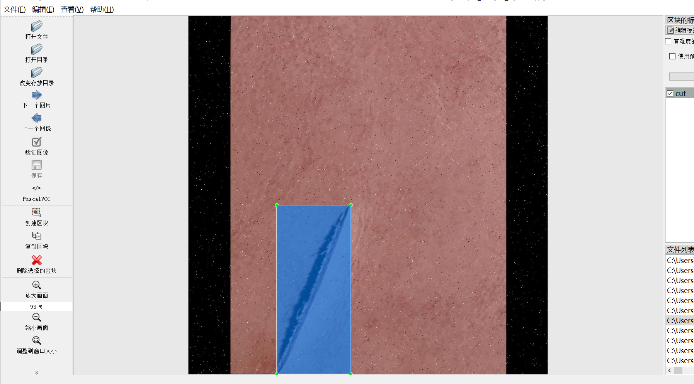
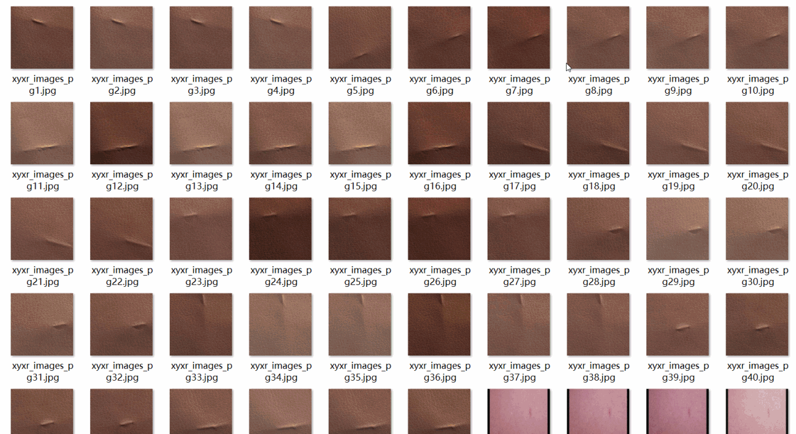
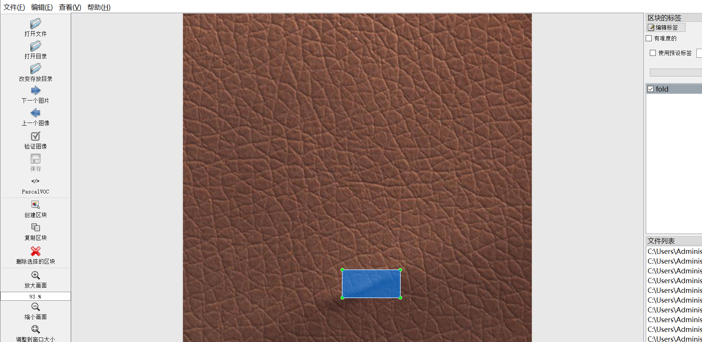
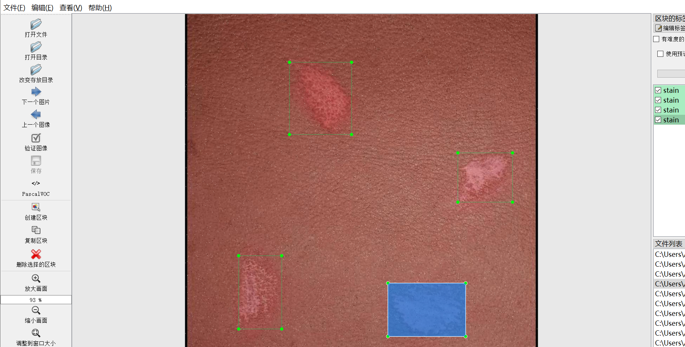

# [Object Detection] Leather Defect Detection Dataset 2869 images3-classLabels YOLO+VOC（containing (Augmented) ）

Dataset Format: VOC format + YOLO format

The compressed file contains: three folders, each storing images, xml files, and text files.

Total jpg images in JPEGImages folder: 2869

The total number of XML files in the Annotations folder is 2869.

The total number of txt files in the labels folder is 2869.

Number of tag types: 3

Tag names: ["cut","fold","stain"]

The number of boxes for each label (Note that the order of labels in the Yolo format does not correspond to this, but is based on the classes.txt file in the labels folder):

cut frame count = 2317

fold frame count = 1962

stain frame count = 960

Total boxes: 5239

Picture clarity (Resolution: Pixels): Clear

Images augmented: Yes

Shape of the label: Rectangular box, used for object detection and recognition.

Important Note: None

Special Notice: This dataset does not guarantee the accuracy or precision of the trained models or weight files. The dataset only provides accurate and reasonable annotations.

Annotation example:

Image overview:

## Images

---

Here is a pay link on Stripe (https://buy.stripe.com/3cs8yP7sY87d0vu9AB). Please contact me lonlonago@foxmail.com after funding $89, and I will send you a complete data files, thank you!

